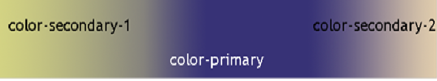

# ITCS1105 Final Project: Client Relations

One day, you are flipping through your email and you see a message with the subject “Would like to hire you!” You aren’t sure if it is spam or a chance at a big front-end web design contract, but you decide (after a moment or two of thinking about it and making sure your virus program is up to date) to open the email. 

Dear web designer:

I represent the EXWHYZEE Widgets company and we are putting together our new web site.  We have someone on the staff who can do the scripting, data base, and back end work, but frankly they are hopeless at colors and layout.  This is where we need you. 

We see a need to make an intro page that talks about the company, a page where we can collect data about customers, and another page where we have a small catalog of materials. 

Make the site look professional and corporate. You decide the exact layout, but the layout should look contemporary. 

Did I mention the company is in France? All the main text is in French (and needs to stay that way – don’t try and translate is), but there are parts in English too. It’s a curious company, certainly. 

I have attached pictures of basically what we want on the page, a large and small graphic of our logo (it’s not very good, please don’t laugh: but you can’t change it as it is on all our marketing material and these are the boss’s grandmother’s favorite colors), and some images for the catalog page.  We’ve changed our minds a few times, so things may not exactly match. However, we heard you were really good at this, so hopefully you can create the site the customer wants. 

Our corporate colors are 



```
.color-primary { color: #373276}	/* Main Primary color */
.color-secondary-1 { color: #D3D383 }	/* Main Secondary color (1) */
.color-secondary-2 { color: #E1CDAD }	/* Main Secondary color (2) */
```

The primary color and one of the secondary colors are valid, the two secondary colors next to each other are not valid.   ----  we do need to have the text viewable by all. 

Oh before I forget: if anyone wants to print any of the pages, they should be in black and white, no fancy fonts, and the only image should be the logo. 

We would like four folders: child_pages, images, scripts, and styles. The main page should be called “exwhyzee.html” and the child pages “about_ exwhyzee.html”, “exwhyzee_customers.html”, and “exwhyzee_catalog.html”.  The style pages should be “exwhyzee_style.css” and “exwhyzee_print_style.css”.  The images are already named for you.  You do not need to create any scripts, and the images (which then go in the images folder) have been provided for you.  You will need two style sheet files in the styles folder. 

Our server is case-sensitive, so the names need to match exactly or the code won’t work.  Our boss also wants every page to be valid, all the CSS to be valid, and each page accessible.  

If I have forgotten anything, please ask the project lead.  They are the ones that have told you to check this message. 

Best wishes,

Web Lead of EXWHYZEE Inc. 
